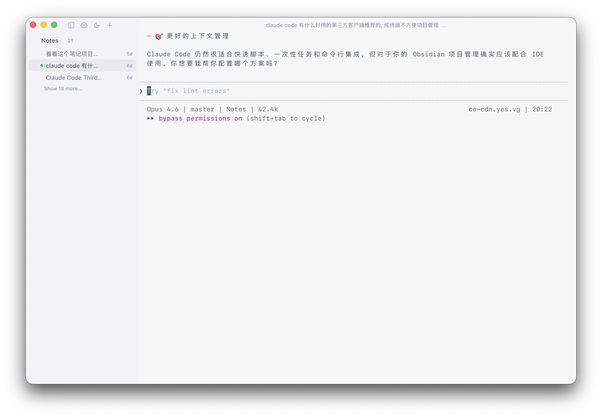

# Claude Session Switch

> A lightweight desktop session switch for Claude Code / Claude CLI.  
> Built with **Tauri + Rust + React + xterm.js** for a hybrid workflow: GUI orchestration + native CLI execution.

English (current) | [中文](./README.md)

---

## Overview

`Claude Session Switch` is not trying to replace your CLI workflow.
It focuses on making session management visual, recoverable, and automation-friendly:

- Organize projects and sessions with a clear UI hierarchy
- Execute real work in embedded/native terminal flows
- Keep behavior config-driven so both humans and AI can manage it
- UI layout and interaction patterns are inspired by the Codex app (desktop), adapted for session-heavy workflows

---

## Design philosophy

This app is not trying to become a heavier IDE.
It is designed as a **lighter, calmer, terminal-first** workspace for session-heavy workflows:

- **Immersive by default**: restrained UI with clear hierarchy, avoiding visual noise
- **Low interruption**: non-essential signals stay subtle so focus remains on active work
- **Terminal-centered**: CLI stays the execution core; GUI focuses on organization and switching
- **Session management first**: quickly locate projects, switch sessions, and restore context
- **Config-driven behavior**: settings live in files for personal tuning and AI-assisted automation

In short: **keep native CLI flow, remove session-management friction.**

---

## Why this exists

Common pain points in daily Claude CLI workflows:

- **Too many projects/sessions, hard to navigate in pure terminal**
- **tmux is powerful but has a higher cognitive overhead**
- **Heavy GUI tools can feel slow and over-engineered**

This project intentionally splits responsibilities:

- GUI handles structure, discoverability, and quick context switches
- CLI handles execution speed, ecosystem compatibility, and continuity

In short: **keep CLI performance, upgrade session management UX.**

---

## Screenshots (Expanded/Collapsed + Light/Dark)

> Put screenshot files under `docs/screenshots/` using the filenames below.

| Light Theme | Dark Theme |
| --- | --- |
| Expanded sidebar   | Expanded sidebar   |
| Collapsed sidebar   | Collapsed sidebar   |

---

## Feature highlights

### 1) Project and session management

- Project/session tree in sidebar (expand/collapse, quick navigation)
- Session rename/stop/delete actions
- Current session title in top bar with `...` action dropdown

### 2) Claude session resume

- Embedded terminal launch supports `claude --resume <session_id>`
- Prefer `tmux` session reuse when available, fallback gracefully otherwise
- Configurable Claude startup args (optional default `--dangerously-skip-permissions`)

### 3) Embedded terminal UX

- Powered by `xterm.js` + `portable-pty`
- Supports output streaming, resize, and external link opening
- Ongoing tuning for smoother scrolling and interaction

### 4) Config-driven (AI-friendly)

- Settings persisted to `preferences.json`
- Theme/language/layout/window size/integrations/session restore are configurable
- Easy to extend via “config-as-interface” automation

### 5) macOS menu integration

App menu includes:

- `Settings…`
- `Open Config File` (open config in system default app)
- `Reload Config` (hot reload latest config into current UI)

---

## Architecture

### Frontend

- React 18 + TypeScript
- xterm.js
- Tauri API (IPC / Window / Event)

### Backend

- Rust + Tauri 2
- portable-pty (PTY lifecycle)
- JSON file persistence for projects/sessions/settings

### Data files

- `projects.json`
- `sessions.json`
- `preferences.json`

Default macOS data directory:

`~/Library/Application Support/CloudCodeSessionManager/`

---

## Config keys (brief)

All app settings are stored in `preferences.json`. Use `Open Config File` from the app menu to edit it.

Commonly used keys:

- `appearance.theme_preference`: theme mode (`light | dark | system`)
- `appearance.language`: UI language (`zh-CN | en-US`)
- `appearance.theme_palettes`: app + terminal color palettes
- `claude.use_custom_startup_args` / `claude.custom_startup_args`: Claude startup args
- `integrations.default_external_terminal` / `integrations.default_external_editor`: external tools
- `ui.sidebar_collapsed` / `ui.layout` / `ui.window`: sidebar/layout/window sizing
- `sessions.restore_last_opened_session` / `sessions.last_opened`: startup restore behavior

After editing, click `Reload Config` in the app menu to hot-reload without restarting.

---


## Quick start

### Prerequisites

- Node.js 18+
- Rust 1.70+
- Recommended: `claude` CLI installed
- Optional: `tmux` for stronger resume behavior

### Run locally

```bash
npm install
npm run dev
```

### Build

```bash
npm run build
```

---

## CI and release

### CI (`.github/workflows/build.yml`)

On `main/develop` pushes and pull requests:

- frontend build
- Rust `cargo check`

### Release (`.github/workflows/release.yml`)

On `v*` tags:

- build and publish macOS binaries for:
  - `arm64`
  - `x64` (Intel)
- auto-generate release notes and `SHA256SUMS`

---

## Project layout (brief)

```text
src/                 # React frontend
src-tauri/src/       # Rust backend
  commands/          # Tauri command entrypoints
  services/          # Domain services (settings/project/session/pty/storage)
  models/            # Data models
```

---

## Roadmap (optional)

- Session search / tags / pin
- More settings (font, keybindings, terminal fine-grained options)
- Better settings schema migration visibility
- Diagnostics export and self-check tooling

---

## License

Released under the [MIT License](./LICENSE).
