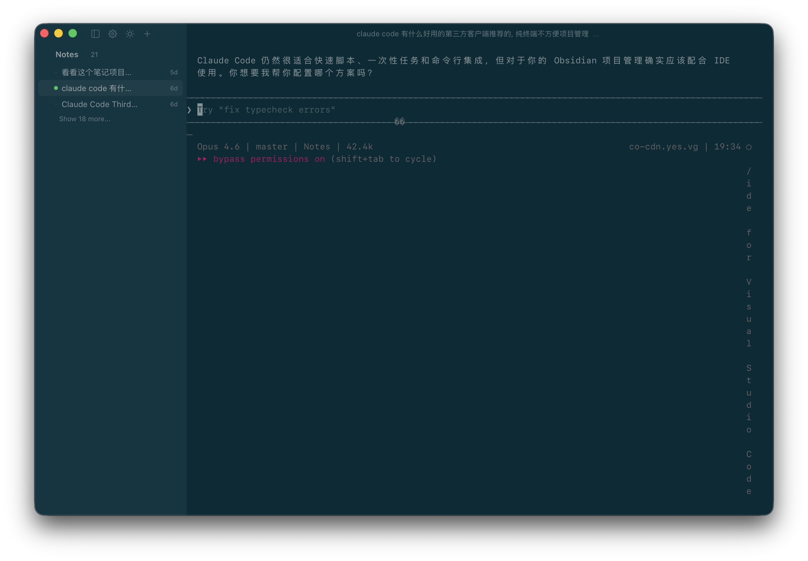
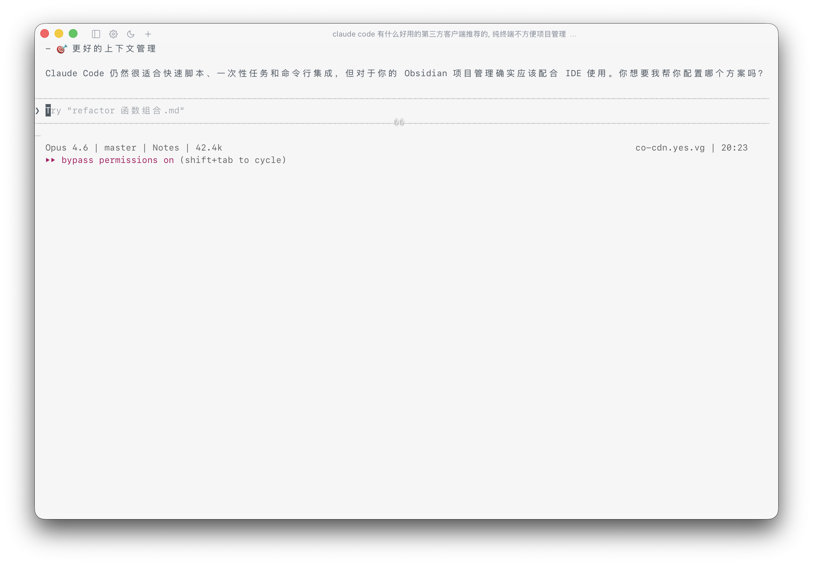
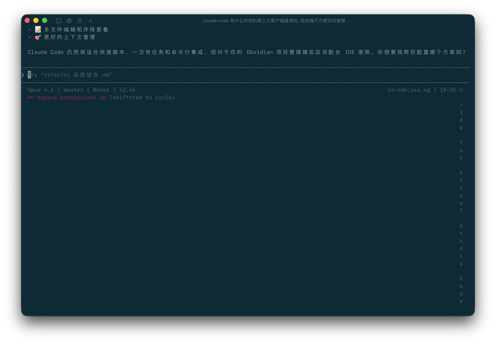

# Claude Session Switch

> Claude Code / Claude CLI 的轻量桌面会话切换器（Session Switcher）。  
> 基于 **Tauri + Rust + React + xterm.js**，支持项目分组、会话恢复与内嵌终端。

[English](./README.en.md) | 中文（当前）

---

## 项目简介

`Claude Session Switch` 关注的核心不是替代命令行，而是把「会话管理」这件事做得更直观、更可恢复：

- 用 GUI 组织项目和会话层级
- 用原生终端与 Claude CLI 执行真实任务
- 用配置文件驱动应用行为，便于人工和 AI 同时管理
- UI 布局与交互细节参考 Codex app（桌面版），并针对会话管理场景做了适配

---

## 设计理念

这个 App 的设计目标不是“做一个更重的 IDE”，而是做一个**更轻、更稳、更不打断思路**的会话工作台：

- **沉浸式优先**：界面尽量克制，视觉层级清晰，但不过度强调装饰
- **减少干扰**：默认弱化非关键信息，让注意力始终落在当前任务与终端输出
- **终端为核心**：CLI 仍是第一执行入口，GUI 只负责组织、切换与管理
- **会话管理高于花哨功能**：快速定位项目、快速切换 session、快速恢复上下文
- **配置驱动**：尽可能通过配置文件管理行为，方便个人定制和 AI 自动化协作

一句话：**让你在保留原生 CLI 体验的同时，获得更顺手的多会话管理能力。**

---

## 为什么做这个项目

日常使用 Claude CLI 时，常见痛点是：

- **会话多、项目多，纯终端切换不够直观**
- **tmux 功能强但学习/维护成本高**
- **很多重型 GUI 工具占资源、链路长，不够“开箱即用”**

这个项目的取舍是：

- GUI 负责：可视化组织、快速切换、配置集中管理
- CLI 负责：执行效率、生态兼容、上下文连续

即：**保留 CLI 的原生性能，补齐会话管理体验。**

---

## 界面截图（展开 / 收起 + 浅色 / 深色）

> 以下截图来自当前代码版本（本地实际运行截图）。

| 浅色主题 | 深色主题 |
| --- | --- |
| 展开侧栏   | 展开侧栏   |
| 收起侧栏   | 收起侧栏   |

---

## 功能亮点

### 1) 项目与会话管理

- 左侧项目树/会话树（展开、收起、快速切换）
- 会话支持重命名、停止、删除
- 顶部展示当前会话名，右侧 `...` 下拉提供会话操作

### 2) Claude 会话恢复

- 内嵌终端启动时支持 `claude --resume <session_id>`
- `tmux` 可用时优先复用会话；不可用时自动降级
- 可配置 Claude 启动参数（默认可选 `--dangerously-skip-permissions`）

### 3) 内嵌终端体验

- 基于 `xterm.js` + `portable-pty`
- 支持终端输出流、窗口 resize、链接点击外部打开
- 持续优化滚动和交互流畅度

> 当前版本说明：
>
> - 已临时停用“Claude 执行完成系统通知”机制
> - 已临时停用“基于 PTY 输出推断运行中 loading”机制
>
> 原因是先保证状态判断准确性与稳定性，后续会在机制更可靠时重新引入。

### 4) 配置驱动（AI 友好）

- 设置统一落盘到 `preferences.json`
- 主题、语言、布局、窗口尺寸、外部终端/编辑器、恢复策略等均可配置
- 支持“配置文件即接口”的二次自动化改造

### 5) macOS 菜单增强

App 菜单提供：

- `Settings…`
- `Open Config File`（用系统默认应用打开配置文件）
- `Reload Config`（热加载最新配置到当前 UI）

---

## 技术架构

### 前端

- React 18 + TypeScript
- xterm.js
- Tauri API（IPC / Window / Event）

### 后端

- Rust + Tauri 2
- portable-pty（PTY 生命周期）
- JSON 文件持久化（项目/会话/设置）

### 数据文件

- `projects.json`
- `sessions.json`
- `preferences.json`

macOS 默认数据目录：

`~/Library/Application Support/CloudCodeSessionManager/`

---

## 可配置项（简略）

应用设置全部在 `preferences.json` 中，推荐通过菜单 `Open Config File` 打开编辑。

常用可配置项：

- `appearance.theme_preference`：主题模式（`light | dark | system`）
- `appearance.language`：界面语言（`zh-CN | en-US`）
- `appearance.theme_palettes`：明暗主题与终端配色
- `claude.use_custom_startup_args` / `claude.custom_startup_args`：Claude 启动参数
- `integrations.default_external_terminal` / `integrations.default_external_editor`：外部工具偏好
- `ui.sidebar_collapsed` / `ui.layout` / `ui.window`：侧栏状态、分栏尺寸、窗口大小
- `sessions.restore_last_opened_session` / `sessions.last_opened`：启动恢复策略

修改配置后可直接在 App 菜单点击 `Reload Config` 热加载生效（无需重启）。

---


## 快速开始

### 环境要求

- Node.js 18+
- Rust 1.70+
- 推荐安装 `claude` CLI
- 可选安装 `tmux`（增强恢复体验）

### 开发运行（推荐 pnpm）

```bash
corepack enable pnpm
pnpm install
pnpm run dev
```

### 构建

```bash
pnpm run build
```

> 兼容说明：保留 npm 脚本，若你习惯 npm，仍可使用 `npm run dev` / `npm run build`。

---

## 发布与 CI

### CI（`.github/workflows/build.yml`）

- 分支 `main/develop` 与 PR 自动执行：
  - `pnpm install --frozen-lockfile`
  - 前端构建
  - Rust `cargo check`

### Release（`.github/workflows/release.yml`）

- 推送 `v*` tag 自动构建并发布
- 产物包含：
  - macOS `arm64`
  - macOS `x64`（Intel）
- 自动生成 GitHub Release Notes 与 `SHA256SUMS`

---

## 目录结构（简版）

```text
src/                 # React 前端
src-tauri/src/       # Rust 后端
  commands/          # Tauri 命令入口
  services/          # 业务服务（settings/project/session/pty/storage）
  models/            # 数据模型
```

---

## 路线图（可选）

- 会话搜索 / 标签 / pin
- 更完整的设置项（字体、快捷键、终端细粒度参数）
- 设置 schema 与迁移可视化
- 诊断日志导出与问题自检

---

## 许可证

本项目使用 [MIT License](./LICENSE)。
